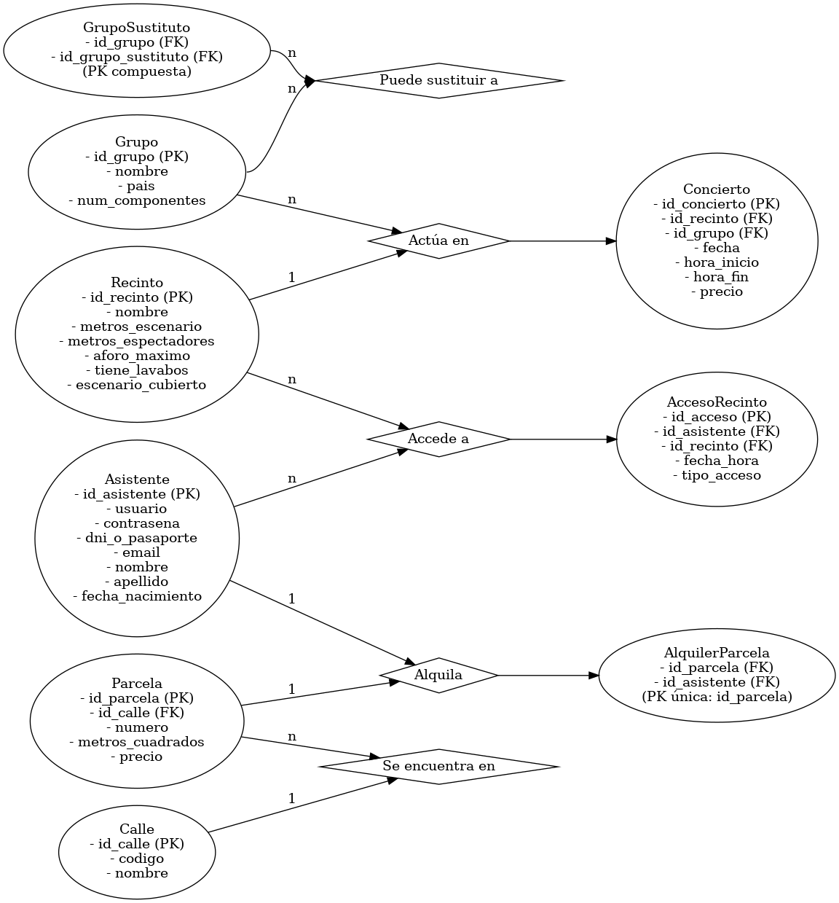

# disseny_DDBB

Festival de Música - Base de Dades

Aquest projecte defineix el disseny d’una base de dades per gestionar un festival de música en una localitat. La base de dades permet gestionar els recintes, grups musicals, concerts, zona d’acampada, assistents i els seus accessos als recintes. El diagrama de l’entitat-relació (ER) de la base de dades segueix el model descrit a continuació.
Estructura de la Base de Dades
1. Entitats Principals
Recinte

    Descripció: Espai on es realitzen els concerts.
    Camps:
        id_recinte (PK), identificador únic del recinte.
        nom, nom del recinte.
        metres_escenari, mida de l’escenari en m².
        metres_espectadors, mida de la zona d’espectadors en m².
        aforament_maxim, capacitat màxima del recinte.
        te_lavabos (boolean), indica si el recinte té lavabos.
        escenari_cobert (boolean), indica si l’escenari està cobert.

Grup

    Descripció: Banda musical que actua al festival.
    Camps:
        id_grup (PK), identificador únic del grup.
        nom, nom del grup.
        pais, país d’origen del grup.
        num_components, nombre de membres del grup.

Concert

    Descripció: Actuació d’un grup en un recinte específic, en una data i hora determinada.
    Camps:
        id_concert (PK), identificador únic del concert.
        id_recinte (FK), relació amb el recinte on es realitza el concert.
        id_grup (FK), relació amb el grup que actua.
        data, data del concert.
        hora_inici, hora d’inici del concert.
        hora_fi, hora de finalització del concert.
        preu, preu que el grup cobra per aquest concert.

GrupSubstitut

    Descripció: Relació que indica els grups que poden substituir a altres en cas de necessitat.
    Camps:
        id_grup (FK), identificador del grup que podria ser substituït.
        id_grup_substitut (FK), identificador del grup substitut.

Carrer

    Descripció: Carrer dins de la zona d’acampada, identificat per un codi i anomenat segons un grup famós.
    Camps:
        id_carrer (PK), identificador únic del carrer.
        codi, codi del carrer.
        nom, nom del carrer.

Parcel·la

    Descripció: Parcel·la de la zona d’acampada.
    Camps:
        id_parcela (PK), identificador únic de la parcel·la.
        id_carrer (FK), relació amb el carrer on es troba la parcel·la.
        numero, número de la parcel·la dins del seu carrer.
        metres_quadrats, mida de la parcel·la en m².
        preu, preu d’allotjament de la parcel·la.

Assistent

    Descripció: Persona registrada que assisteix al festival.
    Camps:
        id_assistent (PK), identificador únic de l’assistent.
        usuari, nom d’usuari de l’assistent.
        contrasenya, contrasenya per a l’accés web.
        dni_o_passaport, DNI o passaport de l’assistent.
        email, correu electrònic.
        nom, nom.
        cognom, cognom.
        data_naixement, data de naixement.

LloguerParcel·la

    Descripció: Indica quin assistent ha llogat cada parcel·la (cada assistent només pot llogar una única parcel·la).
    Camps:
        id_parcela (FK), relació amb la parcel·la llogada.
        id_assistent (FK), relació amb l’assistent responsable del lloguer.

AccesRecinte

    Descripció: Registra cada vegada que un assistent entra o surt d’un recinte.
    Camps:
        id_acces (PK), identificador únic de l’accés.
        id_assistent (FK), relació amb l’assistent que accedeix al recinte.
        id_recinte (FK), relació amb el recinte al qual accedeix.
        data_hora, data i hora de l’accés.
        tipus_acces, tipus d’accés (entrada o sortida).

2. Relacions
Relació entre Recinte i Concert

    Un recinte pot albergar molts concerts, i un concert es realitza en un únic recinte (1, n).

Relació entre Grup i Concert

    Un grup pot fer molts concerts, i cada concert és realitzat per un únic grup (1, n).

Relació entre Grup i GrupSubstitut

    Un grup pot tenir diversos possibles substituts, i un grup pot substituir a altres grups (n, n).

Relació entre Carrer i Parcel·la

    Un carrer té múltiples parcel·les, i cada parcel·la pertany a un únic carrer (1, n).

Relació entre Parcel·la i Assistent a través de LloguerParcel·la

    Un assistent pot llogar una única parcel·la, i cada parcel·la pot ser llogada per un únic assistent (1, 1).

Relació entre Assistent i Recinte a través de AccesRecinte

    Els assistents poden accedir a diversos recintes i múltiples vegades; cada accés es registra (n, n).